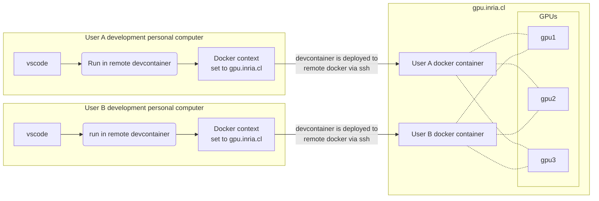

# inria-ml-hello world

[](https://github.com/Inria-Chile/inria-ml-helloworld/actions/workflows/main.yml)

## About the ML hello-world

This repo is meant to help everyone in Inria Chile to use our GPU machine. It also provides a boilerplate implementation of neural networks using PyTorch Lightning. Check out the code as it can serve you to start your own development.

- Read and follow this steps **before** cloning this repo.
- If you find errors in these instructions, correct them and push the corrections.
  
## Set up your development machine setup

### Particular macOS steps

- Install Xcode from the App Store and the Xcode command line tools using the [instructions](https://developer.apple.com/xcode/downloads/). In particular, by running `xcode-select --install`.
- Install [Homebrew (brew)](https://brew.sh/) by running:

    ```bash
    /bin/bash -c "$(curl -fsSL https://raw.githubusercontent.com/Homebrew/install/HEAD/install.sh)"
    ```

  - After installing `brew` run `brew doctor` to check that everything is correct.

### Install docker

Install and configure Docker for your operating system:

- **macOS:** [Docker Desktop for Windows/Mac](https://www.docker.com/products/docker-desktop).
- **Linux:** Follow install instructions for [Docker CE/EE](https://docs.docker.com/install/#supported-platforms) and [Docker Compose](https://docs.docker.com/compose/install/) for your distribution.

### Install Python 3.9.x, `git` and `git-lfs`

- **macOS:** Probably the simplest approach is the use [`brew`](https://brew.sh). Another good choice is to use [`pyenv`](https://github.com/pyenv/pyenv-installer):

    ```bash
    brew install python3.9 git git-lfs
    ```

- **Linux:** In a Debian-based distribution use `apt`:

    ```bash
    sudo apt install python3.9 python3.9-dev python3.9-venv python3-pip git git-lfs
    ```

### Install GitHub credentials support

- **macOS:**

    ```bash
    brew tap microsoft/git
    brew install --cask git-credential-manager-core
    ```

- **Linux:** TODO

### Install [`poetry`](https://python-poetry.org) dependency management tool

We are handling our project dependencies with `poetry`.

```bash
curl -sSL https://install.python-poetry.org | python3 - --preview
```

> Learn the [basics of poetry](https://python-poetry.org/docs/basic-usage/).

### Install Visual Studio Code (vscode)

Download vscode from [https://code.visualstudio.com/](https://code.visualstudio.com/).

> *Luis tip*: I prefer using the [*insiders*](https://code.visualstudio.com/insiders/) version. Use it at your own risk :)

### Setup SSH keys

Run the following command:

```bash
ssh-keygen -t rsa
```

## MLOps tools setup

This is a sophisticated operation. We log our metrics, hyperparams, etc.

### Option 1: *Weight and Biases*

1. If you are using [Weight and Biases](https://wandb.com/) for the first time, register with **your GitHub account** and request a free educational license using your Inria email.
2. Let other member of the team your username so you are added to our groups.
3. Get your API key from <https://wandb.ai/settings>.
4. Edit your `.zshrc` (or `.bashrc` if you are still using bash) file and add the following lines:

    ```bash
    export WANDB_BASE_URL='https://api.wandb.ai'
    export WANDB_API_KEY='<paste API key here>'
    export WANDB_WATCH=all
    ```

**Note:** this config will be passed automatically to the `devcontainer` (see bellow).

### Option 2: *MLFlow*

TODO

### Option 3: *tensorboard.dev*

TODO

### Project setup

- Clone this repository.
  - **Note:** the [`inria-ml-helloword`](https://github.com/Inria-Chile/inria-ml-helloworld) repo is a GitHub template, so you can click on the use this template button and create your own project.
- Using the terminal `cd` into the project folder.
- Set your git local user config.

    ```bash
    git config --local user.name "Your name"
    git config --local user.email your.name@inria.cl
    ```

- Run `poetry install` to install all the project dependencies in a virtual environment `.venv` that will be created in the project folder.

    ```bash
    cd git/inria-ml-hello-world
    poetry install
    ```

- Open project in vscode using File -> Add project to workspace.

  - vscode should detect that you have a virtual environment in `.venv`, click "Accept" to use it.
  - When opening Jupyter notebooks you need to specify the poetry `.venv` folder as a Python interpreter (upper right corner).

## Using Inria Chile's `gpu.inria.cl` GPU server

### Requisites

1. **Access:** You need a username and password to be able to use our GPU machine.
    - If you don't have it, stop now and contact the person in charge.
    - Keep this information in a safe place.
2. **[Optional] Remote access:** If you want to access the GPU machine outside Inria Chile's offices you need to be in our VPN.
    - You should have received a OpenVPN profile (`<user-name>.ovpn` file).
    - Install your OpenVPN profile.
        - macOS: Install [Tunnelblick](https://tunnelblick.net) or [OpenVPN Connect](https://openvpn.net/vpn-client/) and add your `.ovpn` profile file.
        - Linux: TODO.

### Set up an ssh passwordless connection to `gpu.inria.cl`

For this you need to copy your ssh key to the GPU machine this is done with the following command:

```bash
ssh-copy-id <your-gpu-username>@gpu.inria.cl
```

After that, check that it work with:

```bash
ssh <your-gpu-username>@gpu.inria.cl
```

### Create `gpu.inria.cl` remote docker context in your development machine

Docker allows us to create remote contexts and connect to them to deploy containers from your machine. We are going to set this up. This will be then used by devcontainers to deploy our project.



1. To do that, you must run **in your development machine** the following command:

    ```bash
    docker context create inria-gpu --docker "host=ssh://<your-gpu-username>@gpu.inria.cl"
    ```

2. If it went ok when you run `docker context list` there should be a line where the new `inria-gpu` context appears.
3. We must now select the `inria-gpu` context as the active context:

    ```bash
    docker context use inria-gpu
    ```

**Important:** If you ran by mistake the `docker context create` in the GPU server you need to remove it but running in the GPU server `docker context rm inria-gpu`.

### Using vscode's `devcontainer` to deploy the project to the server

We are using [Visual Studio Code Remote - Containers](https://code.visualstudio.com/docs/remote/containers) (devcontainers) to package the project as a docker image that can be deployed to a remote server. Devcontainers rely on docker to create a custom and replicable dev environment with all the project dependencies. Actually, if you want you would just need to install vscode and setup weight and biases to work. In their own words:

> *[...] lets VS Code provide a local-quality development experience — including full IntelliSense (completions), code navigation, and debugging — regardless of where your tools (or code) are located.*

### Launching the project inside a devcontainer

When a vscode project has a devcontainer configured you should see a green button (color may change depending on theme) like this in the bottom left corner:


- Click on the button and then "Reopen in Container".
  - You will see the vscode close and open and a pop-up like this will show. If you click on the link you can see a log of what is going on


- You can also try from the command palette run "Remote-Containers: Rebuild and Reopen".
- At this point a docker image will be created, and the project will be launched inside it.
- This means that the first time it will take a long time.
- The devcontainer is configured to require a GPU on the remote server. If you deploy it to a remote server without a GPU it will produce a (weird looking) error.
- The way of exchanging code between your local machine and the devcontainer is via git. This step is manual.

### Important: **Shutting down your containers**

- In order to allow long experiments runs, the devcontainers are set to **not** automatically shutdown when you disconnect from it (i.e. close vscode).
- It is **your responsability** to shut them down by running `docker ps` to see the running containers and then running `docker stop <container-id>` to stop one particular container.

## Coding practices

1. Whenever possible write unit tests.
2. Before committing code:
   1. Run `black` tool to automatically organize your code.
   2. Run `flake8` to run a static check of your code to ensure that there are no inconsistencies.
   3. Run the unit tests (`pytest`) to check that trivial things are still working.
